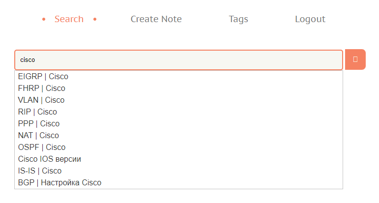

# Taged

Сервис заметок с тегами

В качестве хранилища и поисковика используется [Elacticsearch](https://www.elastic.co/elastic-stack/)

# Установка

**Для запуска требуется более 2Гб свободной оперативной памяти**

Скачиваем репозиторий и переходим в папку

Запускаем контейнеры

    docker-compose up -d

Порт для подключения по http - 8001

Логин: root

Пароль: password

## Поиск по тегам

Указываем, какие теги включить в поиск, а какие необходимо пропускать

Затем пишем интересующую нас строку. Поиск будет и по названию заметки,
и по её содержимому

## Поиск по части названия заметки

## Создание новой заметки

Можно добавлять файлы к заметкам

## Просмотр заметки

## Редактирование заметки

Удаляем прикрепленный файл и добавляем другой

## Создание тегов
