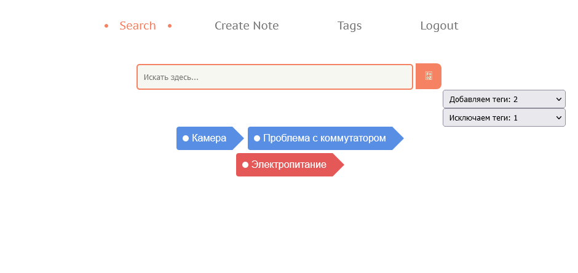
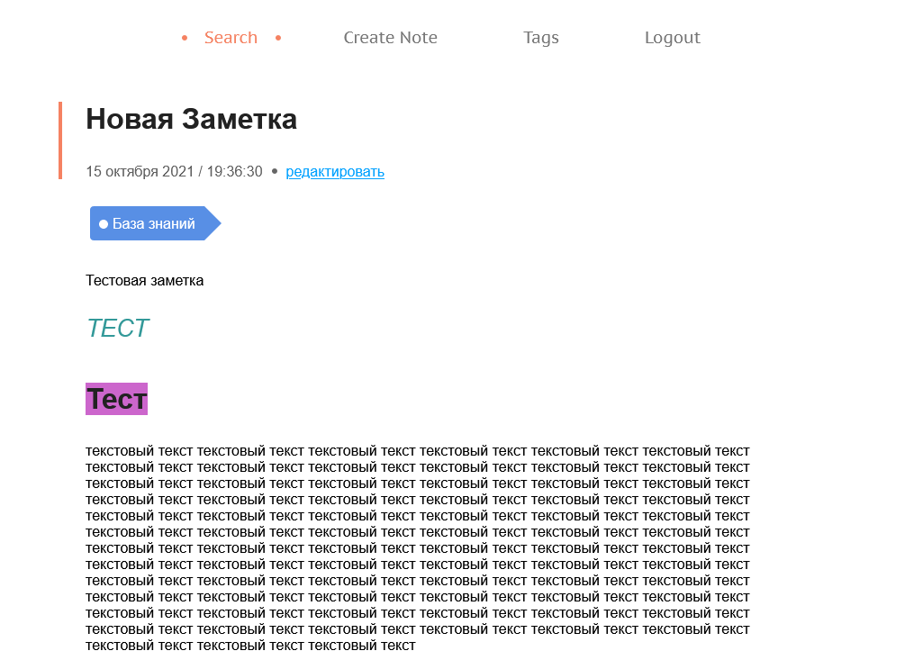
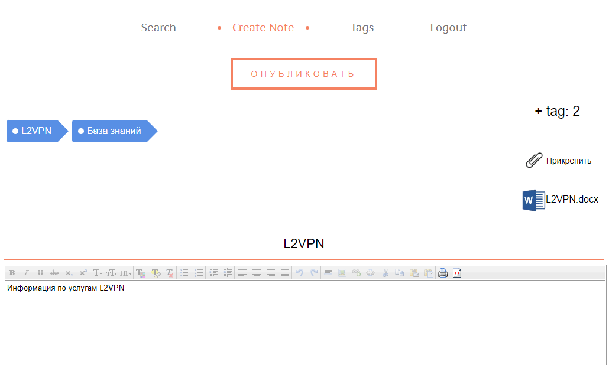

# База знаний

### Гибкое хранилище записей с разграничением уровня доступа

 

В качестве WYSIWYG редактора был выбран CKEditor4

Структура приложения:

## Установка

Для работы приложения на сервер необходимо установить:

1. Создать `.env` файл по примеру из файла `env-example`.
2. Создать `.env-vectorizer` файл по примеру из файла `env-vectorizer-example`.
3. Запустить `docker compose up -d`.
