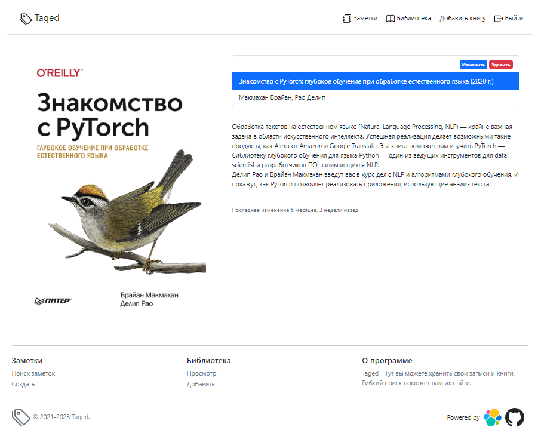

# Taged


[](https://github.com/psf/black)


### Сервис заметок с тегами + библиотека книг

<div>
В качестве хранилища и поисковика используется

<a href="https://www.elastic.co/elasticsearch/" target="_blank" rel="noreferrer">
<span>Elacticsearch</span>

</a>&nbsp
</div>


## Настройка SSL

Переходим в папку `seettings/nginx`, запускаем скрипт для создания 
сертификата:

```shell
cd settings/nginx
bash create_cert.sh
```

После этого будут созданы три файла:

Ключ RSA на 2048 бит - `settings/nginx/private/nginx-selfsigned.key`

Сертификат - `settings/nginx/certs/nginx-selfsigned.crt`

Ключи Диффи-Хеллмана - `settings/nginx/certs/dhparam.pem`


## Запуск

Запускаем контейнеры:

    docker-compose up -d

Логин: root

Пароль: password

## Поиск по тегам

Указываем, какие теги включить в поиск, а какие необходимо пропускать

Затем пишем интересующую нас строку. Поиск будет и по названию заметки,
и по её содержимому


### Просмотр заметки


## Библиотека

Добавление книг и просмотр в браузере


### Описание книги
