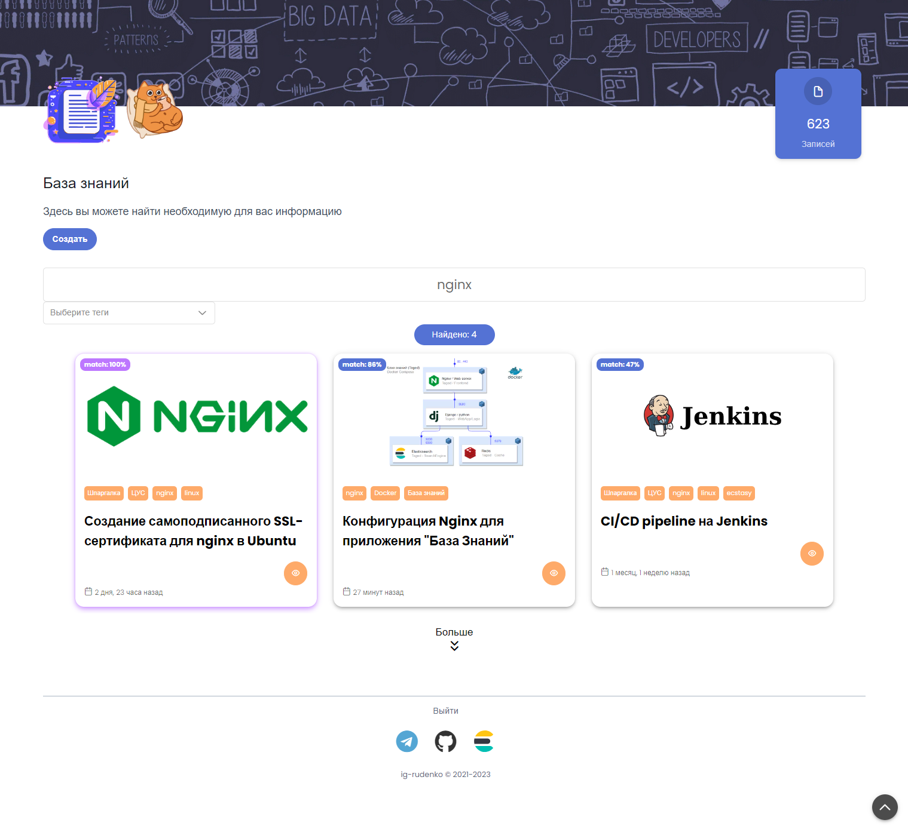

# База знаний


[](https://github.com/psf/black)


### Гибкое хранилище записей с разграничением уровня доступа

<p>

Vue.js - Frontend
</p>

<p>
<a href="https://www.djangoproject.com/" target="_blank" rel="noreferrer"> 
 
</a>
Django - Backend
</p>

<p>
<a href="https://www.elastic.co/elasticsearch/" target="_blank" rel="noreferrer">

</a>
Elacticsearch - Хранилище записей и поисковый движок
</p>
<p>
<a href="https://www.sqlite.org/" target="_blank" rel="noreferrer">

</a>
SQLite - Легкая БД для хранения пользователей
</p>





В качестве WYSIWYG редактора был выбран CKEditor4


## Установка

Для работы приложения на сервер необходимо установить: 
- python (>3.10)
- docker
- docker-compose

### Настройка SSL

Для работы https требуется сертификат и ключ, их можно создать через скрипт
или поместить уже созданные заранее.

Пути требуемых файлов.

- Ключ RSA - `/etc/ssl/taged/private/nginx-selfsigned.key`

- Сертификат - `/etc/ssl/taged/certs/nginx-selfsigned.crt`

- Ключи Диффи-Хеллмана - `/etc/ssl/taged/certs/dhparam.pem`

Создание через скрипт:

```shell
cd settings/nginx
bash create_cert.sh
```

После этого будут созданы необходимые файлы.

### Ansible

Развертывание приложения осуществляется через **ansible**, 
который создает и запускает docker контейнеры через **docker-compose**.

Для этого необходимо изменить файл `ansible/hosts` 
и указать свои данные для подключения и переменные.

```ini
[knowledge_host]
knowledge_host ansible_host=  # Дополнительные параметры подключения

[knowledge-host:vars]
python_version=3.11
root_folder=/opt/taged
DJANGO_SECRET_KEY=django-insecure-o$84xxrt-ip(b7&)wy)ka(@s@7tq()0vs0u(hu*mo7-^uvc_54
django_superuser_username=root
django_superuser_password=password
django_superuser_email=superuser@example.com
```

Далее запускаем ansible.

```shell
ansible-playbook -i ansible/hosts ansible/playbooks/deploy.yaml
```
