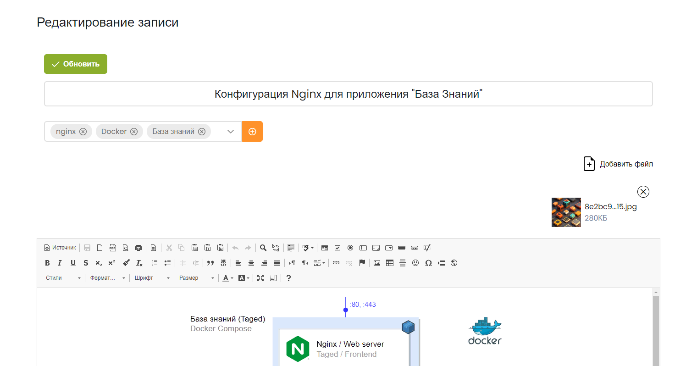

# База знаний


[](https://github.com/psf/black)


### Гибкое хранилище записей с разграничением уровня доступа

<p>

Vue.js - Frontend
</p>

<p>
<a href="https://www.djangoproject.com/" target="_blank" rel="noreferrer"> 
 
</a>
Django - Backend
</p>

<p>
<a href="https://www.elastic.co/elasticsearch/" target="_blank" rel="noreferrer">

</a>
Elacticsearch - Хранилище записей и поисковый движок
</p>
<p>
<a href="https://www.sqlite.org/" target="_blank" rel="noreferrer">

</a>
SQLite - Легкая БД для хранения пользователей
</p>


## Настройка SSL

Переходим в папку `seettings/nginx`, запускаем скрипт для создания 
сертификата:

```shell
cd settings/nginx
bash create_cert.sh
```

После этого будут созданы три файла:

Ключ RSA на 2048 бит - `settings/nginx/private/nginx-selfsigned.key`

Сертификат - `settings/nginx/certs/nginx-selfsigned.crt`

Ключи Диффи-Хеллмана - `settings/nginx/certs/dhparam.pem`


## Запуск

Запускаем контейнеры:

    docker-compose up -d

Логин: root

Пароль: password


В качестве WYSIWYG редактора был выбран CKEditor4



