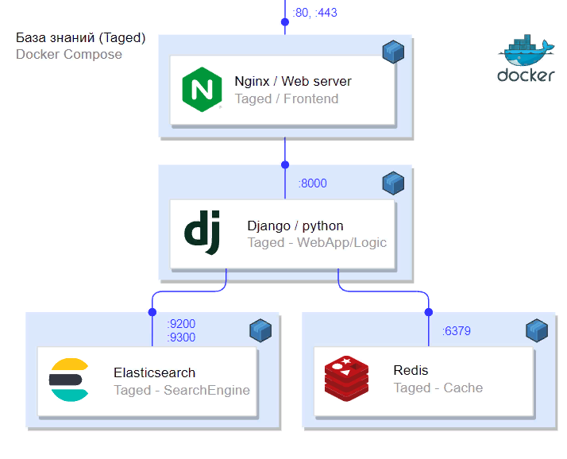

# Taged

Сервис заметок с тегами

В качестве хранилища и поисковика используется [Elacticsearch](https://www.elastic.co/elastic-stack/)

# Установка

**Для запуска требуется более 2Гб свободной оперативной памяти**

Скачиваем репозиторий и переходим в папку

Создаем образ

    docker build -t taged:0.1 .

Запускаем контейнеры

    docker-compose up -d

Порт для подключения по http - 8001

Логин: root

Пароль: password

## Поиск по тегам

Указываем, какие теги включить в поиск, а какие необходимо пропускать

## Просмотр заметки

## Создание/Редактирование новой заметки

## Создание тегов
